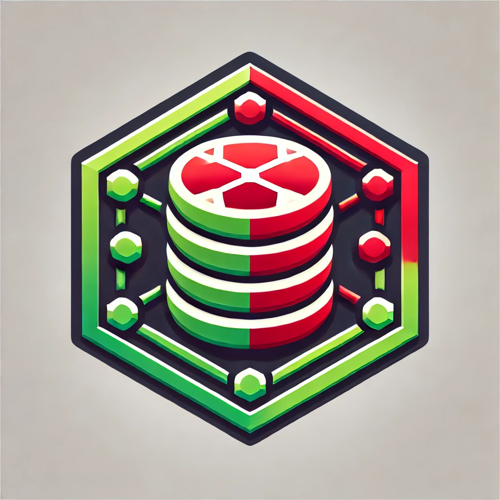

# RedNode - Scalable Node.js Key-Value Store

**RedNode** is a scalable and multi-tenant key-value store built with **Node.js** and **TypeScript**. The system implements essential features of modern distributed storage systems, including **data replication**, **consistent hashing**, **TTL management**, and **multi-tenant architecture**, making it an ideal tool for learning distributed storage techniques. 



## Project Overview

RedNode is designed for developers looking to understand the foundational concepts behind distributed databases and in-memory key-value stores, such as **Redis**. However, it is implemented in a simplified and flexible manner to help users explore its components without the complexity of full-scale production databases.

The key concepts demonstrated by RedNode include:
- **Multi-Tenant Architecture**: Each tenant has isolated key-value storage, ensuring that data is logically separated for different clients. This simulates how cloud-based services can serve multiple clients while maintaining data isolation.
- **Replication**: RedNode supports a **master-slave replication** model, where data written to the master node is replicated across slave nodes, ensuring fault tolerance and redundancy.
- **Consistent Hashing**: Keys are distributed evenly across nodes using consistent hashing, minimizing the data movement when nodes are added or removed.
- **TTL (Time-to-Live)**: Keys can be set with an expiration time, automatically removing them when they expire, making it useful for caching systems.
- **Persistence**: Periodically saves tenant data to disk to ensure data can be recovered in the event of a restart.
- **Pub/Sub**: Supports a basic **publish/subscribe** mechanism, allowing clients to send messages to channels and receive notifications.
- **Custom Script Execution**: Offers the ability to run user-defined scripts on the data store, simulating features of platforms like **Lua scripting in Redis**.

---

## Installation

To install and run RedNode, follow the steps below:

1. **Clone the Repository**:
   ```bash
   git clone https://github.com/yourusername/rednode.git
   cd rednode
2. **Install Dependencies**:
   ```plaintext
   npm install
   
3. **Set Up the Environment Variables**:
   ```plaintext
   PORT=6379 
4. **Compile TypeScript Code**:
   ```plaintext
   npm run build
5. **Start the Server**:
   ```plaintext
   npm start
   
   npm run dev 
